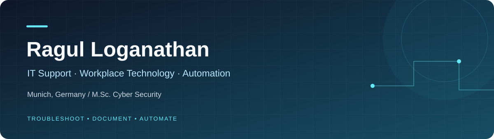

**Munich, Germany · IT Support Engineer at SIXT SE · M.Sc. Cyber Security**

## 👋 Hello, I'm Ragul

I work where enterprise IT support, workplace technology and security meet. At SIXT, I support Windows and macOS endpoints, troubleshoot meeting-room technology, support executive presentations and build PowerShell reporting tools. Previously, I provided L1/L2 support for 150+ users at BayWa r.e.

I completed my **M.Sc. in Cyber Security at Hochschule der Bayerischen Wirtschaft in Munich**. My security background informs how I investigate incidents, assess endpoint issues and document practical solutions. I enjoy making technology easier to support and more reliable for the people using it.

## 🛠️ What I Work With

| Focus | Tools and practical experience |
| :--- | :--- |
| **Enterprise endpoints** | Windows, macOS, Microsoft 365, Intune, Active Directory, Windows 365; device provisioning, onboarding/offboarding and hardware/peripheral troubleshooting |
| **Workplace and meeting technology** | Microsoft Teams Rooms, CollabOS, Logitech Sync; HDMI/display connectivity, cabling investigations and executive presentation support |
| **Incident investigation** | ServiceNow, Jira, root cause analysis, Wi-Fi/VPN/DNS troubleshooting, specialist escalation and reusable support documentation |
| **Operational automation** | PowerShell, read-only SNMP, printer usage counters, CSV reporting and offline/DNS-unresolved device follow-up |
| **Academic systems and security labs** | Ubuntu, Proxmox, Docker, GNS3, pfSense, ELK Stack/Kibana and Snort |

## 🚀 Selected Work

Explore the project repositories below. They currently contain documented overviews; original source files and supporting materials will be added later.

### [Printer Counter and Device Status Reporting](https://github.com/ragul253/powershell-printer-reporting)
**Professional project · PowerShell / read-only SNMP / CSV**

Collected printer usage counters and produced reports with offline and DNS-unresolved device statuses. Reconciled remote data with on-site checks and manual readings when printers were inaccessible or missing from inventory.

### [NVIDIA Jetson Edge-Device Preparation](https://github.com/ragul253/jetson-edge-device-preparation)
**Installation and handover planning · Jetson Orin NX / Ubuntu / JetPack**

Prepared installation and regional handover guidance, assessing platform compatibility, support lifecycle and hardware recovery requirements. This work concerned device preparation and documentation, rather than AI-model development or a completed production rollout.

### [Windows 11 CCTV Workstation Security Baseline](https://github.com/ragul253/windows-workstation-security-baseline)
**Security design and documentation**

Designed and documented a baseline for an unmanaged workstation covering encryption, least privilege, application and kiosk controls, host firewall and audit logging, with mappings to recognised security frameworks.

### [Layer-Aware Incident Analysis and Decision Support for ICS](https://github.com/ragul253/ics-incident-prioritisation)
**Completed master's thesis · Controlled academic lab**

Built an incident-prioritisation prototype using **Python, MQTT, Node-RED, InfluxDB and Grafana**. It combines severity, Purdue-layer context, asset criticality and operational condition to explain incident priority. The prototype was evaluated in a controlled ICS lab.

### [Linux and Security Monitoring Labs](https://github.com/ragul253/linux-security-monitoring-labs)
**Academic projects · ELK Stack / Kibana / Snort / GNS3**

Built industrial-network log-analysis dashboards and configured Snort on a Linux VM in a simulated network. Used port-scan and ping-flood exercises to check alert generation and analyse logs.

## 💻 Earlier Programming Projects

- **[Blood Bank Management](https://github.com/ragul253/bloodbank)** — BCA project using PHP, HTML, CSS, JavaScript and MySQL.
- **[Employee Leave Management](https://github.com/ragul253/Leavemngt)** — early application project using VB.NET and MySQL.

## 🎓 Education and Training

- **M.Sc. Cyber Security** — Hochschule der Bayerischen Wirtschaft, Munich · 2024–2026
- **Bachelor of Computer Applications** — Bengaluru North University · 2020–2023 · GPA 8.60
- **MTA Networking Fundamentals** · Python for Cyber Security Professionals · Postman API Fundamentals Student Expert · Introduction into Cyber Security and Networking Basics

## 🌍 Beyond the Keyboard

English **B2** · German **A1** · Tamil **native**

Based in Munich. Outside technology, I enjoy singing.

---

**Reliable support. Clear documentation. Practical automation.**

[Portfolio](https://ragul253.github.io/portfolio/) · [LinkedIn](https://www.linkedin.com/in/ragul-loganathan-764978269) · [Email](mailto:ragullofficial25@gmail.com)

